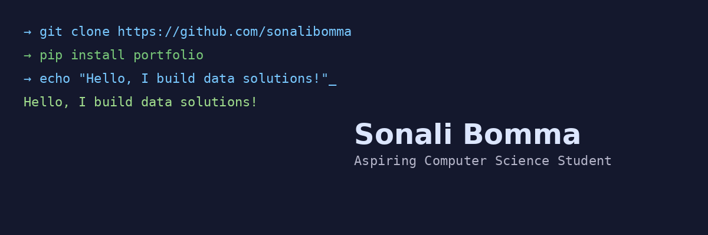

  

<h1 align="center">Hi 👋, I'm Sonali Bomma</h1>

<h3 align="center">
Computer Science Student | Software Developer | AI & Full-Stack Enthusiast
</h3>

Building software that solves real-world problems through AI, distributed systems, and modern software engineering.

---

# 👩‍💻 About Me

🎓 Bachelor of Science in Computer Science  
📍 Wichita State University (Expected Graduation: May 2027)

I'm passionate about designing and building software that creates meaningful impact. My interests span software engineering, artificial intelligence, distributed systems, cloud computing, and data analytics. I enjoy turning ideas into practical applications while continuously learning new technologies.

---

# 🚀 Current Focus

- 🧠 Building a Distributed Machine Learning Simulator
- 📱 Developing Cross-Platform Applications
- 🤖 Exploring Artificial Intelligence & Machine Learning
- ☁️ Learning Cloud Computing & Docker
- 🐧 Strengthening Linux & Git skills
- 💡 Solving Data Structures & Algorithms problems

---

# 💻 Tech Stack

### Languages

### Web Development

### Tools & Technologies

---

# 📂 Featured Projects

## 🧠 Distributed Machine Learning Simulator *(In Progress)*

Desktop application for simulating distributed machine learning environments with configurable network topologies, experiment management, and live execution monitoring.

**Technologies**

Python • GUI • YAML • Distributed Computing • Git

---

## 📱 Cross-Platform Mobile Application *(In Progress)*

Building a modern mobile application featuring intuitive UI design and real-time data visualization.

---

## 📊 Data Analytics Projects

Projects focused on:

- Python Automation
- SQL Optimization
- Data Cleaning
- Data Visualization
- Business Intelligence
- Exploratory Data Analysis

---

# 💼 Professional Experience

## Laboratory Informatics Analyst Intern
**Plastikon Healthcare LLC**

- Automated data extraction and reporting using Python
- Developed SQL queries for analytical reporting
- Built Tableau dashboards for business insights
- Improved database performance through query optimization
- Supported laboratory informatics systems and compliance initiatives

---

## Office Assistant
**Wichita State University**

- Provided technical support to faculty and students
- Assisted with software installations and system operations
- Helped maintain efficient administrative workflows

---

# 🌱 Currently Learning

- Artificial Intelligence
- Machine Learning
- Cloud Computing
- Distributed Systems
- Docker
- Linux
- React
- Software Architecture

---

# 📈 GitHub Goals

- Build impactful software projects
- Contribute to open-source projects
- Learn something new every day
- Share knowledge through GitHub
- Continuously improve as a Software Engineer

---

# 📫 Connect With Me

📧 **Email:**  
sonalibomma2025@gmail.com

💼 **LinkedIn:**  
www.linkedin.com/in/sonali-bomma-6175502b2 

⭐ Thanks for visiting my profile! Feel free to explore my repositories and connect with me.
